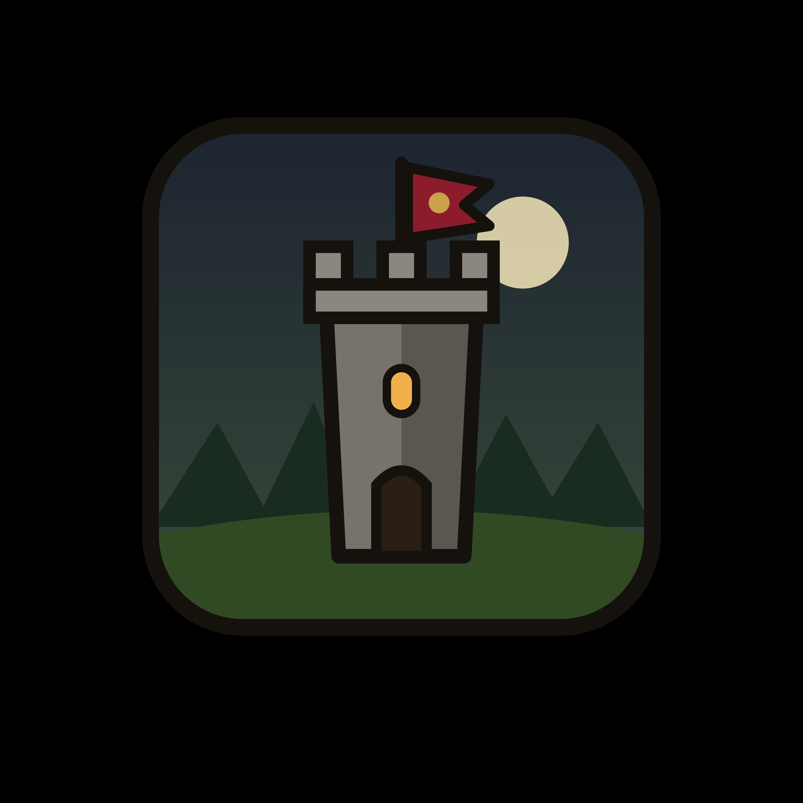

# Veliron's Outpost

Dark-fantasy isometric village simulator and tower defense game made
with Godot 4.7. It targets Web, Linux, Windows and Android and works
with mouse and keyboard or touch.

> _Explore the unknown lands around Veliron's last outpost.
> Build huts, camps and towers. Station military units on them to defend
> the village. Ensure the safety of your villagers. Find unknown treasures
> and kill many monsters. For wealth and glory!_

The last outpost of the kingdom of Veliron is a small village surrounded
by walls. It sits in the middle of a procedurally generated 75x75 map
of different biomes like forests, meadows, heath, steppe, swamps and
terrain features such as lakes, rivers, coastlines and mountains.
Continuous waves of monsters roam around that attack the village and
attempt to kill its inhabitants: goblins, skeletons, rats, slimes, witches,
gargoyles, vampires and many more come down the winding roads from the
map edge towards the village gates. Villagers build, farm and scout on
their own. Your military units try their best to defend the outpost, but
need to be assigned to their stations, so you decide *where*
things get built and *who* mans the towers.

Large parts of this game were built with gen AI, therefore the
internal project structure is quite messy and the code reeks of gen AI.

## Features

* Combination of village simulation and tower defense; keep villagers alive,
  recruit and train military units, station towers and defend the castle
* Procedurally generated maps in different designs and exploration of
  the map during the game to unlock new units 
* Continuous, never-ending waves of different kinds of monsters with
  increasing strength
* Many different military units with branched upgrades after reaching level 3:
  archers, shield bearers, summoners, mages, acolytes and their specialized
  variants
* Collect corpses for extra loot or train your units with the hero's
  experience in the training grounds
* Unique, strong hero unit with many different traits that can be chosen by
  the player: defending the village, exploring, gathering resources,
  building, training, resting
* Tutorial playthrough that teaches the most important parts of the game
* LAN co-op multiplayer up to 8 players, not supported in web version

## Roadmap

* Per-unit targeting strategy
* Web-based multiplayer support that also works across LAN and web somehow
* Hard-coded mid-bosses every 25 waves with many special abilities to keep
  things spicy
* Actually usable relics and perhaps more exploration in late-game
* Scenarios
* Statistics & tables for in-game stats
* Some end-the-game win-condition

## Tests

`tests/` holds headless bots that play the game and check what happens.
Each is a scene that exits 0 when every check passed.
The helper `run_all.sh` can be used to run all, or some specific tests.
Notably, the `net_bot` needs two processes because it simulates LAN play.
